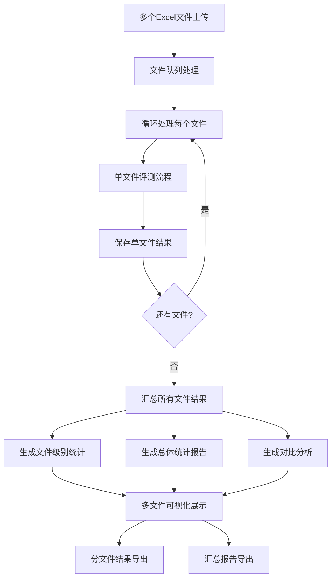

# 🎯 大模型评测系统

基于双重评判机制的LLM能力评估平台，通过两轮评测来区分模型的知识缺失和推理能力不足问题。

## 📋 项目概述

本系统采用创新的双重评判机制，对大语言模型进行全面评估：
- **第一次评判**：基于LLM自身知识回答问题
- **第二次评判**：基于提供的参考内容重新回答问题
- **智能分析**：根据两次评判结果，区分"知识缺失"和"推理能力不足"

## 🏗️ 系统架构

```
大模型评测系统
├── 前端界面 (Streamlit)
├── 数据处理层
│   ├── Excel文件处理
│   ├── LLM接口调用
│   └── 评估模块
├── 存储层
│   ├── 原始数据存储
│   ├── 评测结果存储
│   └── 分析结果存储
└── 可视化分析
    ├── 统计图表
    └── 结果导出
```

## 📊 数据流程图

### 单文件处理流程
```mermaid
graph TD
    A[Excel文件上传] --> B[数据预处理]
    B --> C[第一次评判]
    C --> D[LLM基于自身知识回答]
    D --> E[评估回答质量]
    E --> F{分数是否达标?}
    
    F -->|是| G[标记为"正确"]
    F -->|否| H[进入第二次评判]
    
    H --> I[LLM基于提供内容回答]
    I --> J[评估回答质量]
    J --> K{分数是否达标?}
    
    K -->|是| L[标记为"知识缺失"]
    K -->|否| M[标记为"推理能力不足"]
    
    G --> N[生成最终分析报告]
    L --> N
    M --> N
    
    N --> O[可视化展示]
    N --> P[结果导出]
```

### 多文件处理流程


## 📁 数据格式说明

### 输入数据格式

**Excel文件要求** (存储位置: `data/{模型名称}/`)
- 文件格式：`.xlsx`
- 必需列：
  - `问题编号`: 问题的唯一标识符
  - `问题`: 需要评测的问题内容
  - `答案`: 标准答案
  - `内容`: 用于第二次评判的参考内容

**示例数据结构：**
```
| 问题编号 | 问题 | 答案 | 内容 |
|---------|------|------|------|
| Q001 | 什么是机器学习？ | 机器学习是一种人工智能技术... | 机器学习定义：通过算法让计算机... |
| Q002 | Python中如何定义函数？ | 使用def关键字定义函数 | Python函数语法：def function_name()... |
```

### 输出数据格式

**结果存储结构** (存储位置: `results/{模型名称}/{文件名}/`)

#### 单文件结果
1. **LLM回答文件** (`{文件名}_responses.csv`, `{文件名}_2_responses.csv`)
```csv
id,llm_answer,llm_reasoning
Q001,机器学习是一种AI技术,基于数据训练模型的过程
Q002,使用def关键字,Python中函数定义的标准语法
```

2. **评估结果文件** (`{文件名}_evaluation.csv`, `{文件名}_2_evaluation.csv`)
```csv
id,llm_answer,llm_reasoning,score,reasoning_score
Q001,机器学习是一种AI技术,基于数据训练模型的过程,0.85,0.78
Q002,使用def关键字,Python中函数定义的标准语法,0.92,0.88
```

3. **最终分析文件** (`{文件名}_final_analysis.csv`)
```csv
id,status,file_name
Q001,正确,test1.xlsx
Q002,知识缺失,test1.xlsx
Q003,推理能力不足,test1.xlsx
```

#### 多文件汇总结果 (存储位置: `results/{模型名称}/multi_file_summary/`)

4. **文件级别汇总** (`files_summary.csv`)
```csv
file_name,total_questions,correct,knowledge_missing,reasoning_insufficient,correct_rate,knowledge_missing_rate,reasoning_insufficient_rate,status
test1.xlsx,100,65,20,15,65.0%,20.0%,15.0%,成功
test2.xlsx,80,50,18,12,62.5%,22.5%,15.0%,成功
test3.xlsx,0,0,0,0,0.0%,0.0%,0.0%,失败
```

5. **总体统计汇总** (`overall_summary.csv`)
```csv
metric,value,percentage
总问题数,180,100.0%
正确问题数,115,63.9%
知识缺失问题数,38,21.1%
推理不足问题数,27,15.0%
总文件数,3,100.0%
成功处理文件数,2,66.7%
失败文件数,1,33.3%
```

## 🔧 核心模块详解

### 1. Excel处理模块 (`src/excel_processor.py`)
**功能**: 读取和解析Excel文件
- 验证必需列的存在
- 数据清洗和格式化
- 返回结构化的问题数据

### 2. LLM接口模块 (`src/llm_interface.py`)
**功能**: 与大语言模型API交互
- 支持两种评判模式：
  - **基础模式**: 仅基于问题本身
  - **增强模式**: 基于问题+参考内容
- 自动重试机制
- 响应解析和格式化

### 3. 评估模块 (`src/evaluation.py`)
**功能**: 评估LLM回答质量
- 使用DeepSeek-V3模型进行评估
- 双维度评分：答案准确性 + 推理质量
- 支持多次评估取平均值
- 测试模式：1次评估 vs 正常模式：3次评估

### 4. 结果存储模块 (`src/result_storage.py`)
**功能**: 管理评测结果的存储
- 分层目录结构：`results/{模型名}/{文件名}/`
- 多种结果文件类型
- CSV格式输出，便于后续分析

### 5. 主应用模块 (`app.py`)
**功能**: Streamlit Web界面
- 三个主要界面：开始界面、评测界面、结果分析
- 实时进度显示
- 可视化结果展示

## ⚙️ 评判逻辑

### 双重评判机制

1. **第一次评判**
   - 输入：仅问题内容
   - 目的：测试LLM的基础知识储备
   - 评估维度：答案准确性、推理质量

2. **第二次评判**
   - 输入：问题 + 参考内容
   - 触发条件：第一次评判分数低于阈值
   - 目的：测试LLM的理解和推理能力

### 结果分类逻辑

```python
if 第一次评判通过:
    状态 = "正确"
elif 第二次评判通过:
    状态 = "知识缺失"  # 有了参考内容就能答对
else:
    状态 = "推理能力不足"  # 即使有参考内容也答不对
```

## 🎛️ 配置参数

### 环境变量 (`.env`)
```env
DEEPSEEK_API_KEY=your_deepseek_api_key
SILICONFLOW_API_KEY=your_siliconflow_api_key
```

### 评判参数
- **第一次评判阈值**: 默认0.7，可在界面调整
- **第二次评判阈值**: 默认0.7，可在界面调整
- **测试模式**: 每题评估1次 vs 正常模式每题评估3次

## 📈 结果分析

### 单文件分析
#### 统计指标
- **总问题数**: 评测的问题总量
- **正确率**: 第一次评判就正确的比例
- **知识缺失率**: 需要参考内容才能答对的比例
- **推理不足率**: 即使有参考内容也答不对的比例

#### 可视化图表
- **柱状图**: 各状态问题数量统计
- **饼图**: 结果分布比例
- **详细表格**: 每个问题的具体状态

### 多文件分析
#### 文件级别统计
- **文件处理状态**: 成功/失败文件数量
- **各文件正确率对比**: 横向对比不同文件的表现
- **文件统计表格**: 每个文件的详细统计信息

#### 汇总分析
- **总体统计**: 所有文件的汇总指标
- **文件对比图表**: 各文件表现的可视化对比
- **处理状态分布**: 文件处理成功率统计

#### 分析模式
- **全部文件模式**: 显示所有文件的汇总结果
- **单文件模式**: 选择特定文件查看详细结果
- **对比分析模式**: 文件间的横向对比分析

## 🚀 使用方法

### 1. 环境准备
```bash
# 克隆项目
git clone <repository-url>
cd llm-evaluation-system

# 安装依赖
pip install -r requirements.txt
```

### 2. 配置API密钥
创建`.env`文件并设置API密钥：
```env
# DeepSeek API密钥 (用于LLM回答生成)
DEEPSEEK_API_KEY=your_deepseek_api_key_here

# SiliconFlow API密钥 (用于回答质量评估)
SILICONFLOW_API_KEY=your_siliconflow_api_key_here
```

### 3. 启动系统
```bash
streamlit run app.py
```

### 4. 使用流程

#### 📝 第一步：准备数据
- 准备包含以下列的Excel文件：
  - `问题编号`: 问题的唯一标识
  - `问题`: 需要评测的问题内容
  - `答案`: 标准答案
  - `内容`: 用于第二次评判的参考内容

#### 📤 第二步：上传文件
- 在"开始界面"选项卡中上传Excel文件
- 支持单文件或批量上传
- 系统会自动保存到 `data/{模型名称}/` 目录

#### ⚙️ 第三步：配置参数
- 选择LLM模型
- 设置第一次和第二次评判阈值
- 选择测试模式或正常模式

#### 🎯 第四步：选择文件
- 勾选要评测的文件
- 查看文件信息和状态
- 确认评测流程

#### 🚀 第五步：开始评测
- 点击"开始评测"按钮
- 切换到"评测界面"查看进度
- 实时监控评测日志

#### 📊 第六步：查看结果
- 切换到"结果分析"选项卡
- 查看统计概览和可视化图表
- 下载详细结果和汇总报告

### 5. 高级功能

#### 🔧 调试模式
- 在侧边栏启用"调试模式"
- 查看系统状态和内部信息
- 便于问题排查和性能监控

#### 📁 多文件分析
- 自动生成文件对比分析
- 横向对比不同文件的表现
- 生成汇总统计报告

#### 💾 结果导出
- 支持多种格式的结果下载
- 按状态筛选导出特定结果
- 文件级别统计信息导出

## 📂 目录结构

```
项目根目录/
├── app.py                    # 🎯 主应用程序入口
├── requirements.txt          # 📦 依赖包列表
├── .env                     # 🔐 环境变量配置
├── README.md                # 📖 项目说明文档
├── evaluation_system.log    # 📝 系统日志文件
├── scripts/                 # 🛠️ 功能模块目录
│   ├── __init__.py          # Python包初始化
│   ├── ui_components.py     # 🎨 UI组件和工具函数
│   ├── stage_handlers.py    # 🎭 三个阶段的处理逻辑
│   └── evaluation_logic.py  # 🧠 评测核心逻辑
├── src/                     # 💼 核心业务模块
│   ├── excel_processor.py   # 📊 Excel处理模块
│   ├── llm_interface.py     # 🤖 LLM接口模块
│   ├── evaluation.py        # 📏 评估模块
│   └── result_storage.py    # 💾 结果存储模块
├── data/                    # 📁 输入数据目录
│   └── {模型名称}/          # 按模型分类的数据
│       └── *.xlsx          # Excel数据文件
├── results/                 # 📈 输出结果目录
│   └── {模型名称}/          # 按模型分类的结果
│       ├── {文件名}/        # 按文件分类的结果
│       │   ├── *_responses.csv      # LLM回答
│       │   ├── *_evaluation.csv     # 评估结果
│       │   ├── *_2_responses.csv    # 第二次回答
│       │   ├── *_2_evaluation.csv   # 第二次评估
│       │   └── *_final_analysis.csv # 最终分析
│       └── multi_file_summary/      # 多文件汇总报告
│           ├── files_summary.csv    # 文件级别统计
│           └── overall_summary.csv  # 总体统计
└── test/                    # 🧪 测试目录
```

### 📋 模块说明

#### 🎯 主应用 (app.py)
- 应用程序入口点
- 页面配置和初始化
- 选项卡导航管理
- 错误处理和日志记录

#### 🛠️ Scripts模块
- **ui_components.py**: UI组件库，包含各种界面元素
- **stage_handlers.py**: 三个主要阶段的处理逻辑
- **evaluation_logic.py**: 评测流程的核心实现

#### 💼 Src模块
- **excel_processor.py**: Excel文件读取和数据处理
- **llm_interface.py**: 大语言模型API接口
- **evaluation.py**: 回答质量评估逻辑
- **result_storage.py**: 结果文件存储管理

## 🔍 技术特点

### 🏗️ 架构优势
1. **模块化设计**: 功能模块分离，代码结构清晰
2. **可维护性**: 单一职责原则，便于维护和扩展
3. **可测试性**: 模块独立，便于单元测试
4. **可扩展性**: 新功能可以轻松添加到对应模块

### 🛡️ 稳定性保障
1. **异常处理**: 完善的错误处理和重试机制
2. **日志系统**: 详细的日志记录和文件输出
3. **状态管理**: 完整的session state管理
4. **系统检查**: 启动时自动检查必要文件和目录

### 🎨 用户体验
1. **进度跟踪**: 实时显示评测进度和详细日志
2. **结果可视化**: 多种图表展示评测结果
3. **响应式界面**: 适配不同屏幕尺寸
4. **调试模式**: 开发者友好的调试信息

### ⚡ 性能优化
1. **批量处理**: 支持多文件并行评测
2. **内存管理**: 优化大文件处理
3. **API优化**: 智能重试和超时处理
4. **缓存机制**: 避免重复计算

## � 性开发指南

### 📦 添加新功能
1. **UI组件**: 在 `scripts/ui_components.py` 中添加新的界面组件
2. **业务逻辑**: 在 `scripts/evaluation_logic.py` 中添加评测逻辑
3. **阶段处理**: 在 `scripts/stage_handlers.py` 中修改阶段流程
4. **核心模块**: 在 `src/` 目录中添加新的业务模块

### 🧪 测试
```bash
# 运行测试模式
streamlit run app.py
# 在侧边栏启用"调试模式"查看系统状态
```

### 📝 日志系统
- 系统日志自动保存到 `evaluation_system.log`
- 支持不同级别的日志记录
- 便于问题排查和性能监控

## 📊 性能优化

### ⚡ API调用优化
- 自动重试机制：失败时指数退避重试
- 超时处理：避免长时间等待
- 并发限制：防止API调用过于频繁

### � 内存管理
- 分批处理：大文件分批读取和处理
- 状态清理：及时清理不需要的session state
- 缓存优化：避免重复计算和API调用

### 🚀 并发处理
- 多文件并行：支持同时处理多个文件
- 异步处理：UI响应和后台处理分离
- 进度跟踪：实时显示处理进度

## 🛠️ 扩展性

### 🔌 模块扩展
- **新LLM模型**: 在 `src/llm_interface.py` 中添加新的模型接口
- **评估标准**: 在 `src/evaluation.py` 中自定义评估逻辑
- **数据格式**: 在 `src/excel_processor.py` 中支持新的输入格式
- **存储方式**: 在 `src/result_storage.py` 中添加新的存储格式

### 🎨 界面扩展
- **新组件**: 在 `scripts/ui_components.py` 中添加UI组件
- **新页面**: 在 `scripts/stage_handlers.py` 中添加新的阶段
- **可视化**: 扩展图表类型和分析维度

## 📝 注意事项

### ⚠️ 使用前检查
1. ✅ 确保API密钥有效且有足够的调用额度
2. ✅ Excel文件必须包含所有必需列
3. ✅ 网络连接稳定，支持API调用
4. ✅ 磁盘空间充足，用于存储结果文件

### 🎯 最佳实践
1. **测试模式**: 大规模评测前先使用测试模式验证
2. **批量处理**: 合理控制单次处理的文件数量
3. **定期清理**: 定期清理旧的结果文件释放空间
4. **备份重要**: 重要的评测结果及时备份

### 🐛 常见问题
1. **API调用失败**: 检查网络连接和API密钥
2. **文件格式错误**: 确保Excel文件包含必需列
3. **内存不足**: 减少同时处理的文件数量
4. **界面卡顿**: 刷新页面或重启应用

## 🤝 贡献指南

### 📋 贡献方式
1. **Bug报告**: 提交Issue描述问题和复现步骤
2. **功能建议**: 提交Feature Request描述需求
3. **代码贡献**: 提交Pull Request改进代码
4. **文档完善**: 改进README和代码注释

### 🔄 开发流程
1. Fork项目到个人仓库
2. 创建功能分支进行开发
3. 编写测试确保功能正常
4. 提交Pull Request等待审核

## 📞 技术支持

如遇到问题，请：
1. 查看系统日志文件 `evaluation_system.log`
2. 启用调试模式查看详细信息
3. 提交Issue描述问题详情

## 📄 许可证

本项目采用MIT许可证，详见LICENSE文件。

---

<div align="center">
<h3>🎯 感谢使用大模型评测系统！</h3>
<p>如果这个项目对您有帮助，请给我们一个⭐️</p>
</div>